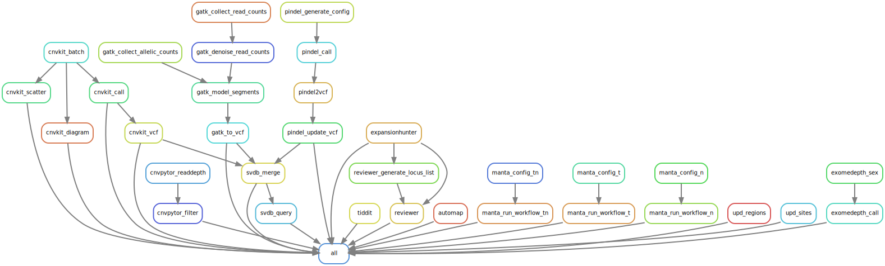

# Hydra-genetics snv_sv module
The cnv_sv module consists of a collection of tools calling larger structural genomic aberrations in DNA. Most tools use aligned `.bam` files as input, but many tools also make use of small variants calls in the form of a `.vcf` file.

## CNV_SV

## Module input files
Aligned and merged `.bam` files as well as different `.vcf` files depending on application.

* `alignment/samtools_merge_bam/{sample}_{type}.bam`
* `snv_indels/bcbio_variation_recall_ensemble/{sample}_{type}.ensembled.vcf`
* `snv_indels/bcbio_variation_recall_ensemble/{sample}_{type}.germline.vcf`
* `snv_indels/glnexus/{sample}_{type}.vep_annotated.vcf.gz`

## Module output files
The output consists of results files that describe different kinds of larger genomic aberrations, such as copy number aberrations (CNVs), structural variants (SVs) and repeat expansions.

* `cnv_sv/automap/{sample}_{type}/{sample}_{type}.HomRegions.tsv`
* `cnv_sv/cnvkit_call/{sample}_{type}.{tc_method}.loh.cns`
* `cnv_sv/cnvpytor/{sample}_{type}.filtered.vcf`
* `cnv_sv/exomedepth_call/{sample}_{type}.txt`
* `cnv_sv/expansionhunter/{sample}_{type}.vcf`
* `cnv_sv/gatk_call_copy_ratio_segments/{sample}_{type}.clean.calledCNVs.seg`
* `cnv_sv/manta_run_workflow_tn/{sample}/results/variants/somaticSV.vcf.gz`
* `cnv_sv/manta_run_workflow_t/{sample}/results/variants/tumorSV.vcf.gz`
* `cnv_sv/manta_run_workflow_n/{sample}/results/variants/candidateSV.vcf.gz`
* `cnv_sv/pindel_vcf/{sample}_{type}.no_tc.vcf`
* `cnv_sv/purecn_purity_file/{sample}_{type}.purity.txt`
* `cnv_sv/reviewer/{sample}_{type}/{sample}_{type}.phasing.tsv`
* `cnv_sv/reviewer/{sample}_{type}/{sample}_{type}.{locus}.svg`
* `cnv_sv/smn_caller/{sample}_{type}.tsv`
* `cnv_sv/svdb_query/{sample}_{type}.{tc_method}.svdb_query.vcf`
* `cnv_sv/tiddit/{sample}_{type}.vcf`
* `cnv_sv/trgt_genotype/{sample}_{type}.vcf.gz`
* `cnv_sv/trgt_plot/{sample}_{type}_{locus}.svg`
* `cnv_sv/upd/{sample}_{type}.upd_regions.bed`
* `cnv_sv/upd/{sample}_{type}.upd_sites.bed`