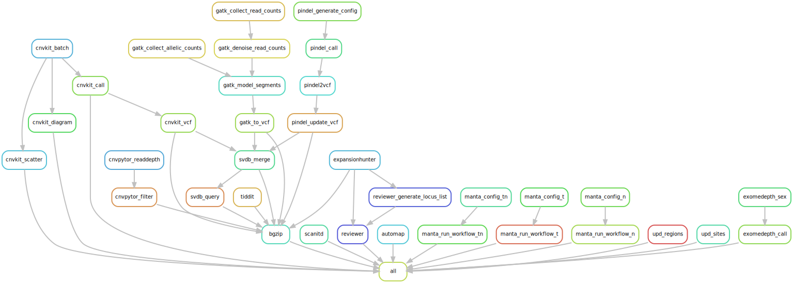
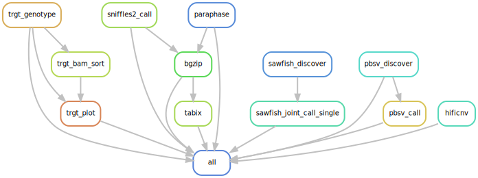

# Hydra-genetics snv_sv module
The cnv_sv module consists of a collection of tools calling larger structural genomic aberrations in DNA. Most tools use aligned `.bam` files as input, but many tools also make use of small variants calls in the form of a `.vcf` file.

## CNV_SV short read steps

## DNA Pacbio steps

## Module input files
Aligned and merged `.bam` files as well as different `.vcf` files depending on application.

* `alignment/samtools_merge_bam/{sample}_{type}.bam`
* `snv_indels/bcbio_variation_recall_ensemble/{sample}_{type}.ensembled.vcf`
* `snv_indels/bcbio_variation_recall_ensemble/{sample}_{type}.germline.vcf`
* `snv_indels/glnexus/{sample}_{type}.vep_annotated.vcf.gz`

Certain tools in this module (e.g. cnvkit batch, hificnv, pbsv, severus, sniffles2) use functions to compile paths to input BAM files. Read more about these functions [here](https://hydra-genetics.readthedocs.io/en/latest/development/input_functions/).

## Module output files
The output consists of result files that describe different kinds of larger genomic aberrations, such as copy number aberrations (CNVs), structural variants (SVs), and repeat expansions. The output files below are subdivided into short-read and long-read categories.

Some short-read tools may run on long-read datasets; however, here we list them under short-read based on their documented and primary use case. A further subdivision for long-read is required, as some programs from Pacbio are designed and licensed for Pacbio data only.

### Short-read
* `cnv_sv/automap/{sample}_{type}/{sample}_{type}.HomRegions.tsv`
* `cnv_sv/cnvkit_call/{sample}_{type}.{tc_method}.loh.cns`
* `cnv_sv/cnvpytor/{sample}_{type}.filtered.vcf`
* `cnv_sv/exomedepth_call/{sample}_{type}.txt`
* `cnv_sv/expansionhunter/{sample}_{type}.vcf`
* `cnv_sv/gatk_call_copy_ratio_segments/{sample}_{type}.clean.calledCNVs.seg`
* `cnv_sv/jumble_vcf/{sample}_{type}.pathology.vcf`
* `cnv_sv/manta_run_workflow_tn/{sample}/results/variants/somaticSV.vcf.gz`
* `cnv_sv/manta_run_workflow_t/{sample}/results/variants/tumorSV.vcf.gz`
* `cnv_sv/manta_run_workflow_n/{sample}/results/variants/candidateSV.vcf.gz`
* `cnv_sv/melt/{sample}_{type}/ALU.final_comp.vcf`
* `cnv_sv/melt/{sample}_{type}/HERVK.final_comp.vcf`
* `cnv_sv/melt/{sample}_{type}/LINE1.final_comp.vcf`
* `cnv_sv/melt/{sample}_{type}/SVA.final_comp.vcf`
* `cnv_sv/pindel_vcf/{sample}_{type}.no_tc.vcf`
* `cnv_sv/purecn_purity_file/{sample}_{type}.purity.txt`
* `cnv_sv/reviewer/{sample}_{type}/{sample}_{type}.phasing.tsv`
* `cnv_sv/reviewer/{sample}_{type}/{sample}_{type}.{locus}.svg`
* `cnv_sv/scanitd/{sample}_{type}.vcf`
* `cnv_sv/smn_caller/{sample}_{type}.tsv`
* `cnv_sv/svdb_query/{sample}_{type}.{tc_method}.svdb_query.vcf`
* `cnv_sv/tiddit/{sample}_{type}.vcf`
* `cnv_sv/upd/{sample}_{type}.upd_regions.bed`
* `cnv_sv/upd/{sample}_{type}.upd_sites.bed`

### Long-read

#### Pacbio or ONT

* `cnv_sv/sniffles2_call/{sample}_{type}.vcf.gz`
* `cnv_sv/sniffles2_call/{sample}_{type}.snf`

#### Pacbio only
* `cnv_sv/hificnv/{sample}_{type}-depth.bw`
* `cnv_sv/hificnv/{sample}_{type}-copynum.bedgraph`
* `cnv_sv/hificnv/{sample}_{type}-vcf.gz`
* `cnv_sv/paraphase/paraphase_{sample}_{type}/{sample}_{type}.paraphase.bam`
* `cnv_sv/paraphase/paraphase_{sample}_{type}/{sample}_{type}.paraphase.bam.bai`
* `cnv_sv/paraphase/paraphase_{sample}_{type}/{sample}_{type}.paraphase.json`
* `cnv_sv/paraphase/paraphase_{sample}_{type}/{sample}_{type}.paraphase_{gene}.vcf.gz`
* `cnv_sv/sawfish_joint_call_single/{sample}_{type}.vcf.gz`
* `cnv_sv/trgt_genotype/{sample}_{type}.vcf.gz`
* `cnv_sv/trgt_plot/{sample}_{type}_{locus}.svg`